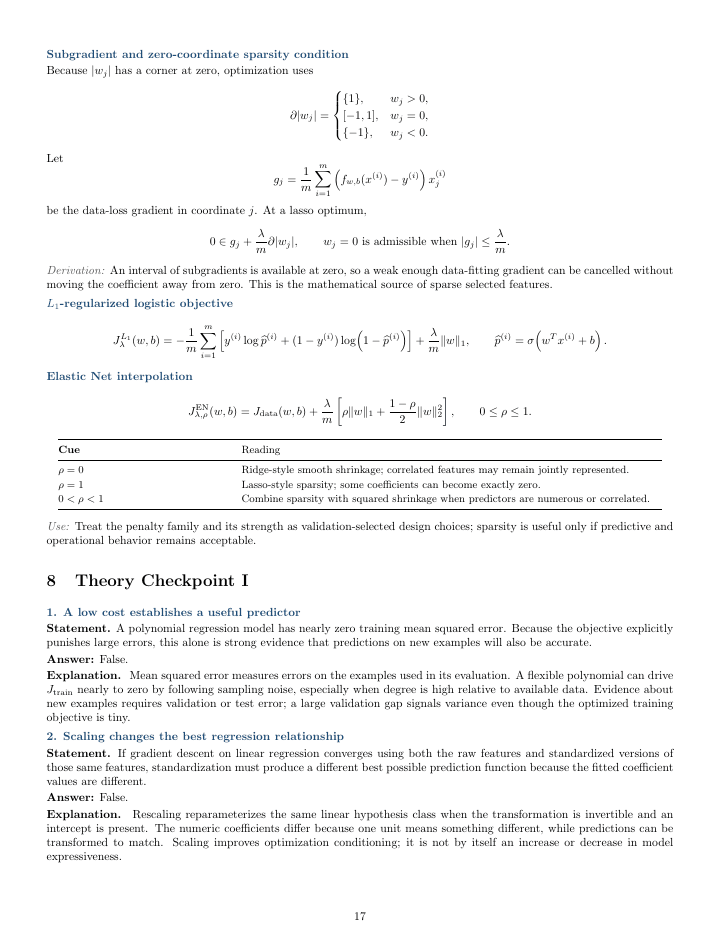
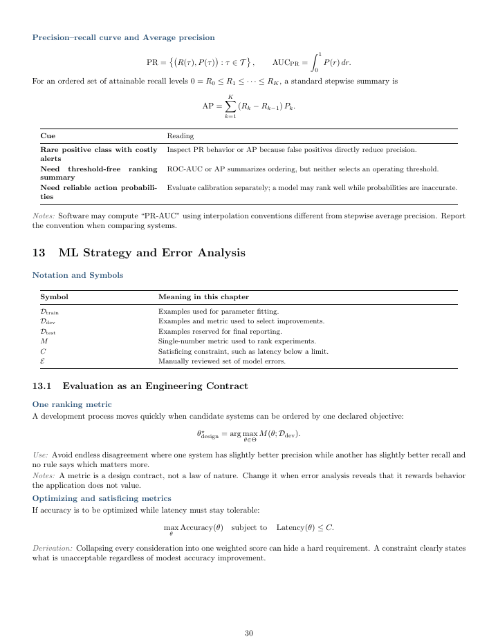
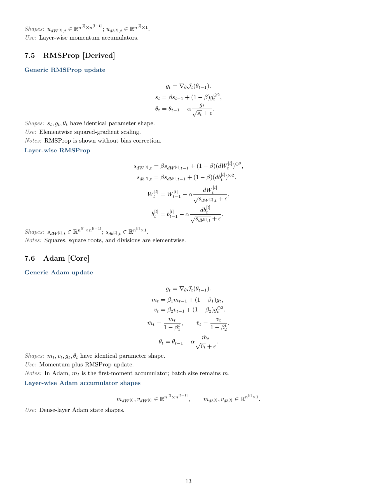
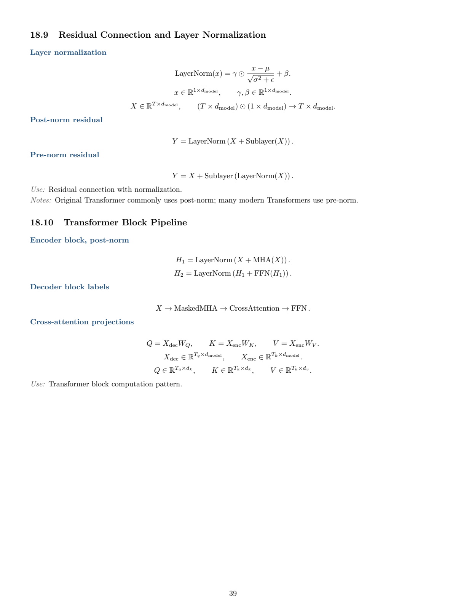

# ML & Deep Learning Formula Cheat Sheets

Compact LaTeX formula references for theory-focused machine learning and deep
learning review.

This repository contains two standalone PDF review sheets designed for quick
mathematical lookup. They emphasize formulas, notation, objectives, update
rules, evaluation quantities, model decisions, tensor shapes where relevant,
and compact derivations without requiring readers to search across full lecture
notes or textbooks.

The content follows the study-material scope covered by each sheet. It is not
intended to be an exhaustive textbook-level reference or a universal catalog of
every machine learning and deep learning topic. Instead, it is a focused
mathematical review resource for beginners and learners who want to strengthen
their theoretical foundation.

These sheets are not tutorials and do not replace complete courses or
textbooks. They are compact references for revision and formula checking.

## Download

| Sheet | Focus | PDF |
| --- | --- | --- |
| Deep Learning Formula Cheat Sheet | Neural networks, optimization, CNNs, sequence models, attention, Transformers, and tensor shapes | [Download PDF](./main.pdf) |
| Machine Learning Formula & Decision Sheet | Regression, classification, evaluation, diagnosis, tree ensembles, clustering, recommenders, and reinforcement learning | [Download PDF](./machine-learning-formula-decision-sheet.pdf) |

## Preview

### Machine Learning Formula & Decision Sheet

<p align="center">
  
  
</p>

### Deep Learning Formula Cheat Sheet

<p align="center">
  
  
</p>

## Release

Deep Learning current draft:

- [v0.2.0 - Formula Hierarchy and Core Extensions](https://github.com/Jerry-0821/ml-dl-formula-cheatsheet/releases/tag/v0.2.0): Updated PDF draft with formula hierarchy labels, high-value missing formulas, refreshed previews, and GitHub Actions build.

Machine Learning current artifact:

- `machine-learning-formula-decision-sheet.pdf`: standalone mathematical review sheet with compact derivations and theory checkpoints.

## Current Status

- `main.pdf` is available as the current Deep Learning v0.2.0 draft PDF.
- `machine-learning-formula-decision-sheet.pdf` is available as the Machine Learning review PDF.
- GitHub Actions currently builds the Deep Learning PDF successfully from `main.tex`.
- The Deep Learning LaTeX sections are maintained in `sections/`.
- `FORMULA_COVERAGE_PLAN.md` defines the formula coverage map and verification checklist.
- `SOURCES.md` records primary workspace sources and source policy.

## Deep Learning Source Build

Local build:

```bash
make pdf
```

Clean local LaTeX artifacts:

```bash
make clean
```

Remove generated PDF:

```bash
make distclean
```

Manual fallback:

```bash
latexmk -pdf main.tex
```

GitHub Actions builds the Deep Learning `main.pdf` and uploads it as the
`deep-learning-formula-cheatsheet-pdf` artifact.

## Deep Learning Authoring Rules

- Keep entries compact.
- Prefer display math for important formulas.
- Add shapes near formulas.
- Use consistent notation from `sections/01_notation.tex`.
- Avoid long derivations unless the derivation itself is the reference item.
- Avoid raw Unicode math symbols when LaTeX commands are clearer.
- Prefer formulas, tensor shapes, update rules, and compact reference tables over prose.
- Do not use external sources to expand project scope.

## Deep Learning Formula Entry Standard

Each formula entry should include only:

- Formula name
- Formula
- Shapes
- Use: one short phrase
- Notes: optional, at most 1-2 bullets

Target LaTeX pattern:

```tex
\FormulaName{Formula name}
\[
...
\]
\Shapes{...}
\Use{one short phrase}
\Notes{one or two short notes only when necessary}
```

## Deep Learning Layout Standard

The PDF uses four layout types:

### Type A: Process / Pipeline Topic

Use for Logistic Regression, Forward Propagation, Backpropagation,
Optimization, Batch Normalization, RNN / LSTM, Attention, and Transformer Block.

Required structure:

- Assumptions / Input Shapes
- Main Process formulas
- Loss / Objective, if relevant
- Backward / Gradients, if relevant
- Update Rule, if relevant
- Symbols and Shapes
- Key Simplifications / Variants, if relevant

Pipeline style:

```tex
X \to Z \to A \to J \to dZ \to dW, db \to \text{update}
```

### Type B: Formula Table Topic

Use for Activation Functions, Loss Functions, Initialization, Regularization
formulas, and Metrics.

Required structure:

- Compact formula table
- Derivative / gradient column where useful
- Range / output type column where useful
- One short use phrase only when necessary
- Symbol notes only when symbols are not obvious

### Type C: Shape Rule Topic

Use for CNN output size, pooling output size, CNN parameter count, RNN
hidden-state shapes, Transformer Q/K/V shapes, and shape reference tables.

Required structure:

- Input shape
- Formula for output shape
- Output shape
- Parameter shape, if relevant
- Symbol table

### Type D: Architecture / Objective Topic

Use for ResNet, Inception, YOLO, Triplet Loss, Neural Style Transfer, Beam
Search, and Transformer Block.

Required structure:

- Core pattern or objective formula
- Symbols
- Shape notes, if relevant
- Compact variants only if important

## Deep Learning Scope

### V1 Core Sections

- 01 Notation and Tensor Shapes
- 02 Logistic Regression
- 03 Forward Propagation
- 04 Activation Functions
- 05 Loss Functions
- 06 Backpropagation
- 07 Optimization
- 08 Initialization
- 09 Regularization
- 10 Batch Normalization
- 11 CNN
- 15 RNN / GRU / LSTM
- 18 Transformer and Self-Attention
- 20 Shape Reference Tables

### V1 Compact Appendix Sections

- 12 Classic CNN Architectures
- 13 Object Detection and YOLO
- 14 Face Recognition and Neural Style Transfer
- 16 Word Embeddings and Language Models
- 17 Seq2Seq, Beam Search, and Attention
- 19 ML Strategy Formula Appendix

### V2 Deferred Topics

- GAN
- VAE
- Diffusion models
- Reinforcement learning
- Modern YOLO variants
- Advanced Transformer variants

## Deep Learning PDF Sections

1. Notation and Tensor Shapes
2. Logistic Regression and Binary Classification
3. Forward Propagation
4. Activation Functions
5. Loss and Cost Functions
6. Backpropagation
7. Gradient Descent and Optimization
8. Initialization
9. Regularization
10. Batch Normalization
11. Convolutional Neural Networks
12. Classic CNN Architectures
13. Object Detection and YOLO
14. Face Recognition and Neural Style Transfer
15. RNN / GRU / LSTM
16. Word Embeddings and Language Models
17. Seq2Seq, Beam Search, and Attention
18. Transformer and Self-Attention
19. ML Strategy Formula Appendix
20. Shape Reference Tables

## Deep Learning Source Policy

Primary sources are the provided workspace materials. External sources should be
used only to verify formulas, shapes, and notation for topics already in the
coverage map. They must not expand the scope unless the topic is already planned.
Every external source used must be recorded in `SOURCES.md`.

## Deep Learning Framework Conventions

- Example index: `(i)`
- Layer index: `[l]`
- Sequence time-step index: `\langle t \rangle`
- Mini-batch index: `\{k\}`
- Main CNN convention: NHWC, with single image `H x W x C` and batch
  `m x H x W x C`
- PyTorch NCHW mapping `m x C x H x W` belongs in the shape reference appendix
- V1 YOLO convention: course-style `S x S x (B * 5 + C)`
- Modern YOLO head variants are deferred to V2
- Transformer starts with simplified single-head `Q`, `K`, `V` shapes, then
  adds batch and multi-head shape references
